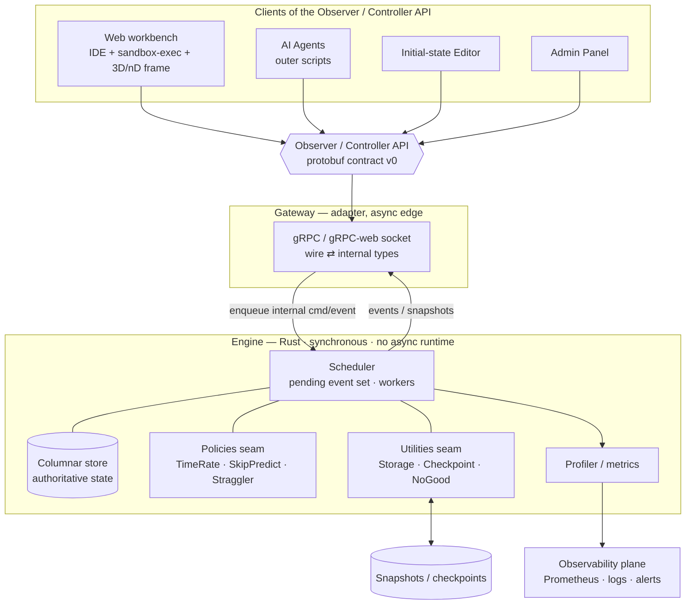

# Universe Simulation — Architecture (v0.8)

> Status: living document. Decisions marked **(ADR-N)** are recorded in §10.
> The build sequence lives in a separate document, **mvp-plan.md**.
> Everything here optimizes for one stated goal: **maximum freedom to rework any
> part with different technology later.**

---

## 1. Goals & hard constraints

- **All parts present in MVP, minimal functionality each.** Universe = 1 object,
  agent = read-only, client = renders one object (walking skeleton).
- **One small server only** (2c / 4 GB / 60 GB NVMe). Firm requirement, kept
  deliberately minimal as a project value. Virtualization only if proven necessary.
- **~30% of effort on optimization** of both the engine algorithms *and* the dev/ops tooling.
- **Architecture first.** Keep clean seams so any box can be swapped for different tech.
- **KISS for the MVP, but always leave a clean seam** for deferred richness.
- Engine in **Rust**. Other components: best tool for the job.

---

## 2. The one principle: contract-first

The backbone of the system is the **Observer / Controller API**. The 3D client,
AI agents, state editor, and admin panel are *all just clients of that one contract*.

If the contract is a versioned schema (protobuf) that lives in the repo as the single
source of truth, then the engine can be rewritten in anything and the client can be
rewritten in anything — as long as the contract holds. **Keep the engine's internal
data model strictly separate from the wire model** so the two evolve independently. **(ADR-1)**

Concrete tell that the seam is intact: there are *two* `Value` types — the internal one
(in `registry`) and the wire one (in `contract`) — and `gateway` maps between them. That
duplication is the seam working, not a smell.

---

## 3. The four seams that buy rework freedom

| # | Seam | Why it matters | MVP form |
|---|------|----------------|----------|
| 1 | **Engine ↔ outside world** = Observer/Controller API | Replace engine OR clients independently | protobuf contract v0; transport behind the gateway |
| 2 | **Engine ↔ persistence** = storage trait | Swap snapshot file → DB later without touching the engine | snapshot to disk + embedded KV (redb/sled) |
| 3 | **Engine ↔ skip/predict logic** = policy trait | "Cut corners" cleverness plugs in without engine surgery | no-op policy |
| 4 | **Everything ↔ observability** = separate plane | Admin/metrics/alerting is an explicit requirement | metrics endpoint + structured logs from day one |

Get these four boundaries right and every box *behind* them is replaceable.

---

## 4. Component map (one server, Docker Compose)



### Technology leanings (all swappable defaults)

- **Engine (Rust):** data-oriented **ECS as a pattern/scheduler** via `bevy_ecs` *as a
  standalone library* (not the game engine), with dense object data in a **hand-rolled
  columnar store**. The execution model is an **event-driven scheduler over a pending set**
  (§5), not a fixed-timestep loop. Parallelism via rayon is forward-looking; tokio only at
  the API edge, never in the engine. **(ADR-2)**
- **API gateway:** gRPC (tonic) — schema-first, streaming, cross-language. The browser is
  served gRPC-web directly via `tonic-web` (no proxy); the gateway also serves the static web
  bundle. **(ADR-3, ADR-22)**
- **State store:** snapshot file + embedded KV (redb/sled) behind the storage trait.
- **AI agents:** external API clients bound to one object each (§5.5). MVP = a thin Python
  SDK over the object API (turtle-graphics ergonomics), run as a sandboxed process.
- **Web workbench:** one browser app = open-source **IDE module (Monaco** — client-side) +
  sandbox-execution service + the **3D/nD visualization as one framed panel**, all client-side.
  **Chrome/Chromium-only → WebGPU**, no WebGL2 fallback. Renderer + nD→3D projection can be
  **JS/Three.js** (lighter) or **Rust via wgpu→WASM** (the Rust avenue). **(ADR-4, ADR-22)**
- **Admin + editor + agent UI:** one small web app (Svelte/React) on the control API.
- **Observability (lean for 2c/4GB):** engine exposes `/metrics` + structured JSON logs
  with logrotate; **offload dashboards/alerting to a free hosted tier** rather than running
  Grafana+Prometheus+Loki on the box. Engine profiler: `tracing` + tracy/puffin in dev only.

### Crate graph (realizes the seams) **(ADR-27)**

```
server (bin) ──► gateway ──► contract        (the wire)
   │                ├───────► engine ──► registry   (the domain)
   │                └───────► registry
   └──► engine, registry              (composition root may touch everyone)
```

- `contract` (lib) — wire types; protobuf-generated. No internal deps.
- `registry` (lib) — schema/type model + manifest loader; owns the *internal* `FieldSpec`,
  `ObjectTypeSpec`, primitive value kinds. No internal deps.
- `engine` (lib) — scheduler, columnar store, seam traits. Depends on `registry`.
  Renamed from "core" to avoid colliding with Rust's built-in `core` crate.
- `gateway` (lib) — the only adapter; maps wire ⇄ internal, hosts the tonic service.
  Depends on `contract`, `engine`, `registry`.
- `server` (bin) — composition root: config, constructs registry+engine, starts the gateway,
  exposes `/metrics`.

**Invariant:** `engine` and `registry` never depend on `contract`, `tokio`, `tonic`, or
`prost`. The domain does not know the wire or the async runtime exists. Only `gateway`/`server`
do. `server`, as the composition root, may depend on everyone — that is its job, not a seam
violation. The graph is a DAG (Cargo forbids cycles). **(ADR-24, ADR-27)**

---

## 5. The engine: an event-driven scheduler

The engine is **not** a tick-driven loop. It is a **scheduler over a pending event set**.

### 5.0 The heart: pending set + workers

Every object carries its own **next-update time**. The scheduler keeps the pending set ordered
by that time; a worker pops the most-due entry, processes it, and the object **re-inserts
itself** at its next step (a lone planet still integrates its own trajectory — nothing has to
"poke" it). Processing may also emit **events to other objects** (interactions), which enter
the same pending set.

- **Pending set (the heart).** One unified priority structure ordered by next-update time.
  Holds both self-update events and interaction-delivery events. *Workers ≠ objects:* a worker
  is a compute unit draining the set. The engine evolves all objects "simultaneously" from their
  own viewpoints, bounded only by memory.
- **State (separate layer).** Authoritative object data lives in the columnar store (§5.7),
  a layer distinct from the compute. Processing reads/writes state; the scheduler decides order.
- **Boundary = a synchronous in-process port.** The engine exposes an **enqueue** method for
  *internal* command/event types and an outbound **event/snapshot channel**. It has no socket and
  no async runtime. The gateway owns the gRPC socket, deserializes wire → internal command,
  enqueues, and serializes outbound events → wire. **(ADR-1, ADR-24)**
- **Policies extend the scheduler; utilities are called by it.** `TimeRatePolicy`,
  `SkipPredictPolicy`, `StragglerDetector` shape scheduling; `Storage`, `Checkpoint`, `NoGood`
  are driven utilities the engine calls out to. All are seams; all are no-ops in the MVP.

### 5.1 No global clock — three times, kept separate **(ADR-5, ADR-7)**

There is no global tick driving the engine. Time appears in three distinct roles; mixing them
corrupts the physics, so they stay separate (this generalizes the old "time is physics,
optimization is not" rule):

1. **Proper time** — per object, `LocalClock { proper_time, rate }`: what the object physically
   experiences. `rate` is **relativistic time dilation derived from physical state**, supplied by
   `TimeRatePolicy` (→ `1.0` in MVP; real dilation from velocity/potential later). This is *state*,
   not a driver. n-dimensional space is already handled by the variable-length coordinate vector
   (ADR-8). A second time dimension (post-MVP) would make `proper_time` a vector — isolated behind
   the clock seam, so an extension, not a rewrite.
2. **Coordinate / "universe" time** — a common axis to order the pending set across objects, since
   proper times on different clocks can't be compared directly. Choosing this foliation is the deep
   open question, **deferred to v1**; with one object there is nothing to order.
3. **GVT (Global Virtual Time)** — the minimum unprocessed timestamp = the **front of the pending
   set**; the frontier below which nothing can ever change. Pure executor bookkeeping, not physics.
   See §5.4. **Deferred** (trivial in MVP).

### 5.2 Determinism — strong form deferred to v3+; keep only the cheap half **(ADR-6)**

Bit-exact, cross-environment determinism for chaotic, precision-sensitive interacting physics is
correctly deferred to v3+ — it would demand fixed-point or extraordinary float discipline that
fights both performance and physical fidelity, and it is **not load-bearing** here: the
authoritative recompute *replaces* a prediction, so it need not reproduce it (§5.4).

What stays, because it is nearly free:
- Simulation time is **decoupled from wall clock and render rate** (events advance sim time).
- **Deterministic event tie-breaking** in the pending set (stable order when timestamps collide).
- Seed any RNG and pass it explicitly; no wall-clock branching in sim logic.
- A single-threaded **replay/debug mode** for reproducing a bug on one machine/binary.
- Stamp every snapshot/checkpoint with `sim_version` + `seed`.

Parallel production runs may legitimately diverge run-to-run once real interactions exist; that
is acceptable for a study tool.

### 5.3 Read model — "both" from day one over one state representation **(ADR-7)**

The engine owns the schedule and free-runs; clients observe. One control model serves both read
styles: a free-running stream, and a paused engine that clients step on demand.

### 5.4 Optimistic execution, rollback & GVT **(ADR-10, ADR-16–18, ADR-25)**

**Optimism is the price of going out of order.** A single worker draining the pending set **in
timestamp order is conservative**: every event it generates lands ahead of everything still
pending, so no straggler is possible and no rollback ever occurs. Paradoxes appear only when
processing goes **out of order** — parallel workers advancing different time-regions concurrently,
or a **speculative leap** past an interaction not yet computed (the skip/predict seam). Rollback is
the correction for that optimism.

**Trigger — paradox detection (ADR-16).** A rewind fires when a **causal violation** is detected:
an interaction event is delivered to an object bearing a causal timestamp earlier than events that
object has already processed (a **straggler**, Time Warp in relativistic dress). The engine fires
the rewind to stay consistent; observers do not command it. The detector sits on the causal event
ordering; it is dormant in the MVP (1 object, in-order, no interactions).

**Scope — localized, over a causal graph (ADR-17).** Only the affected region/objects roll back.
The engine records which object's state was computed from which others (in an ECS the system access
records *are* the edges); rolling back follows those edges — **cascading rollback** (Time Warp
anti-messages). MVP has no edges, but a **scope-aware** `rollback(affected_set, to_time)` goes in
now so it is not a retrofit.

**Semantics — guided re-derive (ADR-18).** Recompute forward from the rewind point; the new future
may differ (consistent with §5.2). A rollback emits a **`RewindSummary`** (the paradox, the
entities/events involved, the rewind point) into a **no-good store**, and the heuristic/skip-predict
logic *reads* the store on recompute to avoid recreating the paradox — **conflict-driven learning**
(CDCL / no-good recording / dependency-directed backtracking).

**GVT — the commit & reclaim frontier (ADR-25).** GVT is the minimum unprocessed timestamp, i.e.
the **front of the pending set**: nothing earlier can ever be generated, so below-GVT history is
final. It does two jobs: **memory reclamation** (fossil-collect/thin everything below it — this is
exactly what turns "unlimited *reach*, not unlimited *storage*" into reality inside 60 GB) and
**commit** (what observers may trust as final vs provisional, and the only point at which
irreversible egress may happen). GVT is *derived*, not a driver, and trivial in MVP (one object →
GVT = its `local_time`). Computing it cheaply across nodes is the known-hard part of Time Warp —
a multi-server concern, free on one box.

**Bounding rollback.** Rewind reach equals how far the spread of local times is allowed to grow.
That bound is a **memory limit plus a calculation-order optimization** (the 30% budget), deferred
past v0. Landmine for that work: OOM must be replaced by *graceful* backpressure (throttle the
front-runners before the wall) so the engine degrades instead of crashing.

**The loop:** optimistic out-of-order advance → straggler detector fires → localized rollback over
the causal graph + emit `RewindSummary` → guided re-derive consuming the no-good store → affected
observers receive `Invalidate(from_local_time)` and reconcile their local history (§5.5). The
recompute is authoritative by definition.

Prior art worth mining: **Jefferson's Time Warp / optimistic PDES** (stragglers, anti-messages,
state-saving, GVT) and **conflict-driven learning** (CDCL, truth-maintenance no-goods).

### 5.5 Agent & observation model **(ADR-12 / ADR-13 / ADR-14)**

**Epistemics (ADR-12).** An agent receives two streams — its **own state** and **what it
observes** — both indexed by its **local time**. It has no god's-eye view. It pulls **one initial
full snapshot**, then receives **incremental deltas only**. It keeps a **local history** (a bounded
ring buffer); on `Invalidate(from_local_time)` it either **rewinds its local history to the mark**
or, if the mark predates the buffer, **resets** (re-pull a full snapshot, then resume deltas). The
engine is authoritative; the agent reconciles. A pure rewindable instrument needs **no commit
signal** of its own — commit only matters at irreversible egress, which the MVP agent never crosses.

**Binding (ADR-13).** One agent ⇄ **exactly one object**, reached through the object API only. Each
object type publishes a **param schema with per-field read/write flags**:
- star → `birthtime` (read-only); `temperature`, `spectral_lines` (writable)
- spaceship → `thrust`, `scan_vectors` (writable)

The agent's capability surface = that object's writable params + reads. Ergonomics follow **turtle
graphics**: bind, then drive with simple imperative calls and watch the result.

**Present-tense control (ADR-26).** Because the agent shares its object's frame, the agent's "now"
*is* the object's local time. So `SetObjectParams` applies at the object's **current** local time
(**apply-now**), and can never be a straggler. (It could only be retroactive in a world where
control crosses frames or carries real propagation delay — ruled out by one-agent-one-object
binding.) The trade is a little open-loop staleness (the command acts on slightly older
observation) for *zero* control-induced rollback — the right trade for a study instrument.

**Control → observation loop.** Some writable params are *actuators* (thrust, temperature); others
are *sensors / observation directives* (detector scan vectors). Setting sensor params tells the
engine **where and how the agent is looking**, which drives where the engine spends careful
computation; that refined region flows back through the observation stream.

**Execution (ADR-14).** MVP: agents run as **resource-limited subprocesses** (separate OS process,
memory/CPU rlimits, restricted filesystem, **no network except the object-API socket**). Isolation
is a swappable policy behind the agent-runner; container → gVisor/microVM arrive when agents stop
being trusted. Server-side privileged agent code is post-MVP.

### 5.6 Region structure, checkpointing & scaling **(ADR-19, ADR-20)**

The world is a **hierarchy of regions at different scales** (cluster ⊃ galaxy ⊃ solar system),
because cross-region coupling is **weak**. This is hierarchical n-body / cosmological simulation:
**octree / Barnes–Hut / Fast Multipole** for the far field, **AMR** for multi-scale fidelity.
Distant regions feel only a coarse, slowly-varying aggregate, so a local rollback perturbs that
aggregate slightly instead of cascading.

**One structure, three payoffs.** The region tree + per-node far-field summary serves
(1) compute efficiency (Barnes–Hut); (2) **bounding the rollback cascade** (weak coupling attenuates
it at boundaries); (3) the **multi-instance partition** (ADR-19) — a subtree shards to another node
and only its aggregate crosses the link.

**The unified pending set is the one-region base case.** At scale the single pending set (§5.0)
shards into **per-region pending sets** with weak cross-region coupling — exactly this hierarchy.
So the MVP's single set is not a dead end; it is the correct degenerate case of the region tree.

**Checkpointing.** Per-region, attached to tree nodes, at **scale-appropriate cadence** — small/fast
regions often, large/slow rarely — driven by events + a per-scale local-time cap. Unlimited *reach*
comes from geometric thinning + re-simulation below GVT (§5.4). Δτ values are config.

**Multi-instance readiness (ADR-19).** Build a single instance now; keep three cheap commitments:
(i) region/object IDs are **location-independent** logical addresses; (ii) inter-object influence is
**causally-timestamped events through a channel**, never synchronous global reads; (iii) the
**engine is the sync authority** (owns scheduling). No distribution is built.

**KISS for MVP.** A "region" is a node abstraction that *may* have parent/children and *may* expose
an aggregate, but MVP runs **one flat region with one object** — no tree, no aggregation. The
straggler **detector is a stubbed interface**, inert at 1 object; the no-good seam is **reserved
call sites only**.

### 5.7 Object type model & schema **(ADR-21)**

A **data-driven type registry over dense columnar storage**. Flexibility lives in the schema
(cold path); density lives in the storage (hot path); different layers.

**Primitive value set** (the only kinds the store packs densely): `Scalar{f64}`, `Int{i64}`,
`Bool`, `Vector{f64; N}`, `Enum{small set}`, and `List{of a primitive}` for rare/variable data.
`List` is the only non-fixed-width kind.

**FieldSpec:** `name`; `kind`; `unit` (schema metadata); `access` (ReadOnly | ReadWrite — the agent
gate, ADR-13); `optional` (false = dense column on every instance; true = sparse); `constraints`.

**ObjectTypeSpec** `{ type_name, fields: [FieldSpec] }`, held in a **registry loaded as data** and
exposed via `DescribeObjectType` / `ListObjectTypes` (§6). New object types are a data change, not a
redeploy.

**Two density-preserving rules:**
- Units are **schema metadata, not per-value storage** — stored once on the FieldSpec.
- The **wire mirrors the store** — streams/photos send *ordered values* keyed to a schema version,
  not `{name: value}` maps; names/units resolve from the cached schema.

**Schema → storage bridge.** Non-optional field → packed column; `optional` → sparse column; `List`
→ side arena keyed by id. `SetObjectParams` validates writes against the FieldSpec (exists,
`access==ReadWrite`, kind, constraints) — the runtime validator that pays for data-driven flexibility.

**MVP:** one registered type; a `Vector` position (ADR-8) + one writable `Scalar` (temperature) +
one `ReadOnly` (birthtime); registry + `DescribeObjectType` + validator; packed columns. `List` /
`Enum` / optional sparse fields / structured units are seams, deferred.

---

## 6. Observer / Controller API v0 (sketch)

```
// Reading
GetState(ViewSpec)                -> WorldState          // current snapshot (historical at_time deferred)
SubscribeState(ViewSpec)          -> stream ReadEvent    // live; WorldState OR Invalidate
                                                          // post-mark data is provisional (rollback deferred)

// Control (the engine owns scheduling)
Control(Command)                  -> Ack   // Start|Stop|Pause|Step(n)|Resume|Save|Load(id)
                                           // Step(n) = process n scheduler events, NOT global ticks

// Controller path: an observer changes its own params, applied at its current local time
SetObjectParams(ObjectId, [(field, Value)]) -> Ack   // validated against the type schema (ADR-26)

// Schema introspection (powers SDK generation, validation, self-describing photos)
ListObjectTypes()              -> [type_name]
DescribeObjectType(type_name)  -> ObjectTypeSpec       // see §5.7

message ReadEvent  { oneof e { WorldState state; Invalidate invalidate; } }
message Invalidate { double from_local_time; }          // "forget everything after this mark"
message WorldState { string sim_version; uint64 seed; repeated Object objects; }
                     // no global tick; a GVT/committed-frontier field is added when rollback lands
message Object     { uint64 id; string type_name; double local_time;
                     repeated Value values; }            // ORDERED per the type's FieldSpec list (§5.7)
message Value      { oneof v { double scalar; int64 int; bool boolean;
                     repeated double vector; uint32 enum; repeated Value list; } }
                     // position is just the Vector-kind field; unit/name come from the schema (ADR-8)
message ViewSpec   { Region region; repeated string fields; uint32 max_objects; double fidelity; }
```

Future-proofing embedded above:
- **Position is a `Vector`-kind field** so 2D / 3D / n-D all fit one schema. **(ADR-8, §5.7)**
- **No global tick.** Each object carries `local_time` (proper time); the global coordinate is GVT,
  added to `WorldState` only when rollback becomes real (protobuf field-add is backward-compatible).
- **`Invalidate` is keyed on `from_local_time`** (absolute local-time mark). Never fires in MVP.
- **`ViewSpec`** is the observer-read hook — region filter, field selection, fidelity. MVP returns
  everything; an agent's `ViewSpec` is bound to its object's frame (initial full snapshot, then deltas).
- **A command is a writable field** (you set `thrust` / `scan_vectors`). True verb-style actions, if
  ever needed, are a future `Invoke(action, args)` seam.

---

## 7. Repo & deployment topology (tuned for 2c / 4GB / 60GB)

- **Monorepo**, Cargo workspace for Rust crates (under `crates/`); the protobuf schema lives in one
  shared place and generates code for every language. **(ADR-9)**
- **Swap-freedom comes from the contract, not the process boundary. (ADR-11)** On 4 GB, co-locate
  **engine + gateway as one Rust binary** (`server`, separate crates behind the API contract); the
  gateway also serves the static web bundle, so the only other process is the agent. Split into
  separate containers the day you outgrow the box — the contract makes that safe.
- **Embedded DB in-process** (redb/sled/SQLite). No separate Postgres container.
- **CI offloaded** to a hosted runner (GitHub Actions → GHCR). The box only *runs* artifacts.
- **On 2 cores, do not over-thread the sim.** MVP runs **one in-order worker** (conservative, no
  rollback). rayon/parallel scheduling is forward-looking for when you upgrade.
- **Disk hygiene:** logrotate + snapshot/checkpoint pruning to live within 60 GB.
- **Prod:** Compose on the box under a **systemd** unit; images from **GHCR**, pulled via a scripted
  `compose pull && up`. Versioned releases + rollback runbook.

---

## 8. ADR backlog

- ADR-1 Wire model separate from engine model
- ADR-2 (revised) ECS as data-oriented pattern + scheduler (bevy_ecs/rayon); **event-driven
  scheduler over a pending set is the execution model** (fixed-timestep is just the trivial policy);
  dense object data in a hand-rolled columnar store
- ADR-3 gRPC/tonic as the API transport
- ADR-4 (revised) Web workbench (Monaco IDE + sandbox-exec + 3D/nD frame); native client dropped
- ADR-5 (revised) Per-object `LocalClock { proper_time, rate }` as **state**; no `dt_global` driver;
  TimeRatePolicy seam (rate = 1.0 MVP)
- ADR-6 Determinism: strong form deferred to v3+; cheap half kept (seeded RNG, deterministic event
  tie-break, single-threaded replay)
- ADR-7 (revised) Snapshot + stream over one state representation; engine owns scheduling; **no global
  tick — global coordinate is GVT, deferred**
- ADR-8 Variable-length coordinate vector (n-dimensional)
- ADR-9 Monorepo + shared protobuf
- ADR-10 Optimistic speculative execution (checkpoint + rollback + invalidate); **conservative
  in-order = no rollback; optimism is the price of parallel/speculative out-of-order execution**
- ADR-11 Swap-freedom from the contract, not the process boundary (co-locate on small hardware)
- ADR-12 Agent epistemics: frame-local own-state + observation; init full then incremental;
  rewind/reset on invalidate
- ADR-13 Agent ⇄ one object via object API; per-field read/write param schema
- ADR-14 MVP agents = resource-limited subprocess (no egress except API); harden later
- ADR-15 All visualization (projection, geometry, skin) is client-side; engine emits raw physical data
- ADR-16 Rewind is paradox-driven, fired by a straggler/causality detector (not observer-commanded)
- ADR-17 Localized rollback over a causal dependency graph; cascading rollback (anti-messages)
- ADR-18 Guided re-derive: rollback emits a RewindSummary into a no-good store (conflict-driven learning)
- ADR-19 Multi-instance readiness: location-independent IDs, event-based interaction, engine as sync authority
- ADR-20 Hierarchical region tree + far-field aggregation (Barnes–Hut/AMR); **unified pending set is the
  one-region base case**; per-node scale-aware checkpoints
- ADR-21 Object types: data-driven registry over dense columnar storage; fixed primitive value set;
  units as schema metadata; optional sparse fields
- ADR-22 Browser: Chrome/Chromium only → WebGPU-only; transport = gRPC-web via tonic-web (no proxy);
  gateway serves the static web bundle
- ADR-23 State export tool (CSV/JSON), schema-driven, present from day one
- **ADR-24 (new) Engine boundary is a synchronous in-process port (enqueue command/event + outbound
  event channel); gateway owns the socket and maps wire ⇄ internal; engine/registry depend on no
  async runtime or transport (no tokio/tonic/prost)**
- **ADR-25 (new) GVT = minimum timestamp in the pending set (front); powers memory reclamation
  (fossil collection) and commit/observer-trust; derived, not a driver; deferred (trivial in MVP)**
- **ADR-26 (new) Present-tense control: `SetObjectParams` applies at the object's current local time
  (apply-now); never a straggler under frame-local agent binding**
- **ADR-27 (new) Crate graph realizes the seams: `server → gateway → {contract, engine, registry}`,
  `engine → registry`; engine/registry contract-agnostic; engine renamed from "core" (std-crate collision)**

---

## 9. Open questions

All MVP-shaping design questions are decided. Remaining items are number-tuning or post-MVP — none
blocking Phase 0:

- **Ordering coordinate ("universe time")** — the common axis the scheduler sorts the pending set by
  across objects. The deep one, **deferred to v1**; inert at one object.
- **Bounded optimism** — capping the local-time spread to bound rollback cost; a memory limit + a
  calculation-order optimization (the 30% budget). Post-v0. Replace OOM with graceful backpressure.
- **Storage mechanism** — decided: a hand-rolled columnar store; the Slice-4 spike confirms the layout.
- **Checkpoint Δτ / thinning ratios** — approach decided (§5.6); numbers deferred.
- **Causal-ordering / straggler rule** — interface stubbed; co-develops with relativistic time (§5.1).
- **`RewindSummary` fields & no-good matching** — seam reserved; fleshed out with speculation work.
- **Sandbox hardening beyond subprocess** — container/gVisor when agents become untrusted.
- **Free linear projection / grand-tour** — frame-side, no engine change.
- **`List` / `Enum` / optional-sparse fields / structured units** — deferred richness.
